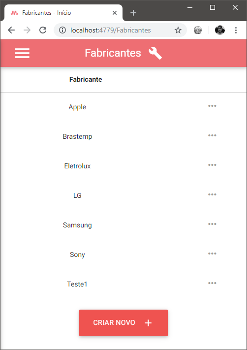
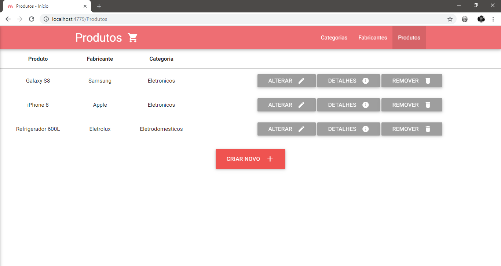

# ASP.NET 4.5 e MVC 5: Aplicação CRUD
  
  Trabalho desenvolvido na disciplina de Ferramentas de Desenvolvimento(5º Período) do Curso de Ciência da Computação, com o objetivo de estudar a plataforma ASP.NET juntamente com a arquitetura MVC. Para tal, foram utilizadas a plataforma ASP.NET 4.5.2 e arquitetura MVC 5.2.3.0. 
  
  Para armazenar e manipular os dados, foi utilizado o Entity Framework(versão 6.0.0.0) com abordagem *Model First*, isto é, o esquema do banco de dados é criado a partir do modelo da nossa aplicação. 
  
  Ainda, para desenvolver o front-end da aplicação, foi utilizado o framework Materialize 0.97.6 e o JQuery 2.1.1.
  
  
#### TODOS OS DADOS UTILIZADOS NO PROJETO SÃO FICTÍCIOS, E FORAM CRIADOS COM O ÚNICO INTUITO DE ESTUDO. 

##### Outros desenvolvedores: Willian Pereira Mariano

#### Capturas de tela:

 
